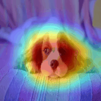
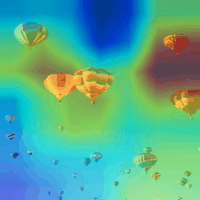
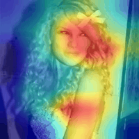
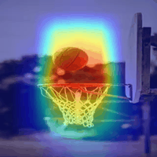
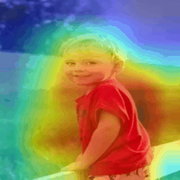
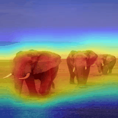
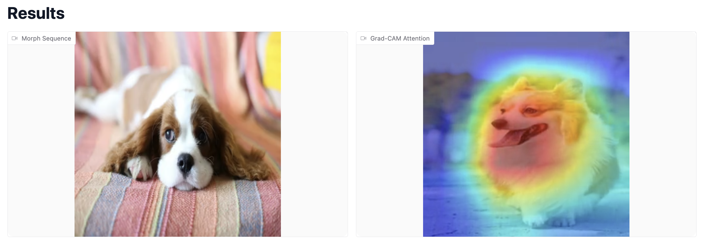
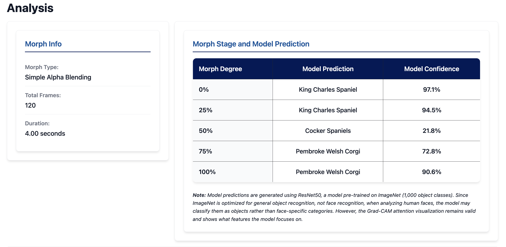

# XAI Morphing Studio

Jennifer Li

**[👉 Try It Online on Hugging Face Spaces](https://huggingface.co/spaces/Jenniferli/XAI_Morphing_Studio)**

**[📹 Watch Demo Video on YouTube](https://www.youtube.com/watch?v=i4DUM8bhkH8)**

Deep vision models like ResNet and techniques like Grad-CAM sit behind many of the "magic" image features we use every day—classification, search, recommendation, content filtering—but most of the time we have no idea why they make the decisions they do. That missing "why" is exactly what Responsible AI and explainable AI (XAI) are trying to surface, so we can debug failures, uncover biases, and build systems people can actually trust.

In this project, I built an XAI Morphing Studio, using a hands-on and visual way to poke at these models and literally watch how their attention shifts as images change. The studio morphs between two images and, frame by frame, shows where a ResNet50 is looking using Grad-CAM heatmaps. As the morph unfolds, you can see predictions and confidence scores update in this process.

By visualizing abstract model reasoning as a dynamic, observable process, the XAI Morphing Studio bridges the gap between algorithmic transparency and human interpretability, advancing both the rigor and accessibility of explainable AI!

## Video Examples

The following 4x4 table showcases 8 image pairs with their morph and Grad-CAM visualizations. Each pair shows the morph animation (top) and Grad-CAM visualization (bottom).

<table>
<tr>
<td align="center">
<strong>Cavalier → Pug</strong><br>
<br>

</td>
<td align="center">
<strong>Bird → Polar Bear</strong><br>
<br>

</td>
<td align="center">
<strong>Balloon → Bridge</strong><br>
<br>

</td>
<td align="center">
<strong>Taylor Swift Evolution</strong><br>
<br>

</td>
</tr>
<tr>
<td align="center">
<strong>Meat → Ice Cream</strong><br>
<br>

</td>
<td align="center">
<strong>Basketball → Soccer</strong><br>
<br>

</td>
<td align="center">
<strong>Boy → Man</strong><br>
<br>

</td>
<td align="center">
<strong>Elephant → Monkey</strong><br>
<br>

</td>
</tr>
</table>


## Project Structure

```
XAI_Morphing_Studio/
├── app.py                # Flask web application (local version)
├── app_gradio.py         # Gradio application (Hugging Face Spaces version)
├── requirements.txt      # Python dependencies
├── README.md             
├── backend/
│   ├── __init__.py
│   ├── morph_engine.py   # Image morphing engine
│   └── gradcam_engine.py # Grad-CAM visualization engine
├── static/
│   ├── css/
│   │   └── style.css     # Web interface styles
│   ├── js/
│   │   └── main.js       # Frontend JavaScript
│   ├── images/           # Image data organized by category
│   │   ├── animals/
│   │   ├── cats/
│   │   ├── dogs/
│   │   ├── food/
│   │   ├── life/
│   │   ├── men/
│   │   ├── sports/
│   │   └── taylor swift/
│   ├── gif/              # GIF animations for README examples
│   ├── mp4/              # MP4 video examples
│   └── results/          # Screenshot examples
├── templates/
│   └── index.html        # Main web page template (Flask)
└── outputs/              # Generated video files (created automatically)
```


## Usage

### Option 1: Try It Online (Hugging Face)

The XAI Morphing Studio is deployed on **Hugging Face Spaces**! You can use it directly in your browser without any installation:

**[👉 Try XAI Morphing Studio on Hugging Face Spaces](https://huggingface.co/spaces/Jenniferli/XAI_Morphing_Studio)**

#### Using the Hugging Face App

1. **Select Images** - You have 4 ways to provide images:
   - **Option 1:** Click the middle camera button at the bottom of the image box to open your webcam, and take a photo for either or both images directly.
   - **Option 2:** Click "Get Random Images" to randomly select two images from pre-loaded categories (animals, cats, dogs, food, life, sports, etc.)
   - **Option 3:** Upload images by clicking on the "Source Image" or "Target Image" boxes and selecting files from your computer
   - **Option 4:** Drag and drop images directly into the image boxes

3. **Generate Morph** - Click "Generate Morph" button:
   - **First click:** Runs the analysis and displays the results (morph info and prediction timeline)
   - **After the analysis appears, click "Generate Morph" again** to generate and display the videos (morph sequence and Grad-CAM visualization)

4. **View Results**:
   - Watch the morph video showing the smooth transition between images
   - Watch the Grad-CAM video showing CNN attention visualization
   - Review the analysis section showing morph details and model predictions at different stages (0%, 25%, 50%, 75%, 100%)

**Note 1:** The app is deployed on Hugging Face Spaces (free tier).   
**Note 2:** Generation takes several minutes depending on server load, typically 1-3 minutes. When multiple users are trying it at the same time, it might load slowly or temporarily time out. If that happens, please refresh or try again a bit later. Thank you for your patience and interest!

### Option 2: Run Locally

1. **Clone the repository** (or navigate to the project directory):
   ```bash
   cd XAI_Morphing_Studio
   ```

2. **Install dependencies**:
   ```bash
   pip install -r requirements.txt
   ```

3. **Run the Flask application**:
   ```bash
   python app.py
   ```

   The server will start at `http://localhost:5006`


4. **Open your browser** and navigate to `http://localhost:5006`

5. **Select Images**:
   - Click "Get Random Images" to randomly select two images from the same category
   - The application includes pre-loaded images in multiple categories: animals, cats, dogs, food, life, sports, and taylor swift

6. **Generate Morph**:
   - Click "Generate Morph" to create the morphing sequence
   - Watch the progress updates as frames are generated
   - The process includes:
     - Image loading and preprocessing
     - Face detection (if applicable)
     - Morph frame generation
     - Grad-CAM analysis for each frame

7. **View Results**:
   - Watch the morph video showing the transition between images
   - Watch the Grad-CAM video showing CNN attention visualization
   - Review the prediction timeline showing model predictions and confidence scores


## Results Example

**1. Image Section**


**2. Video Results**


**3. Analysis Results**



## License

This project is provided as-is for educational and research purposes.


## Acknowledgments

- Uses MediaPipe for face landmark detection
- Uses PyTorch Grad-CAM for attention visualization
- Uses ResNet50 pre-trained on ImageNet
- Built with Flask web framework (local version)
- Built with Gradio for Hugging Face Spaces deployment (Hugging Face Spaces version)
- Deployed on Hugging Face Spaces


*Note: Claude Sonnet 4.5 and Cursor Composer 1 were used to help debug the code and draft Github Repo ReadMe.*
